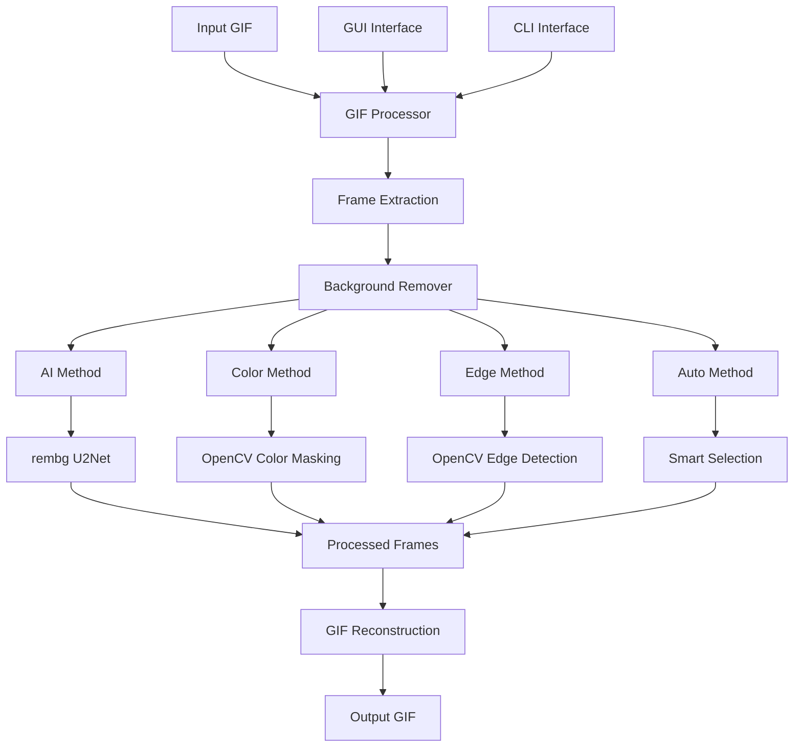

# 🎨 GIF Background Remover

A powerful Python tool to remove backgrounds from GIF images while preserving animation quality. Supports multiple background removal methods including AI-powered processing.


## 🛠️ Tech Stack

### 🐍 Core Programming


### 🤖 AI & Machine Learning


### 🎨 Image Processing


### 💻 User Interface


### 🧪 Testing & Development


### 📦 Package Management


## 🏗️ Architecture Overview



## 📊 Technology Specifications

### Core Libraries & Versions
| Technology | Version | Purpose |
|------------|---------|---------|
| **Python** | 3.8+ | Core programming language |
| **Pillow (PIL)** | 9.0+ | Image processing & GIF handling |
| **OpenCV** | 4.5+ | Computer vision algorithms |
| **NumPy** | 1.21+ | Array operations & math |
| **rembg** | 2.0+ | AI background removal |
| **PyTorch** | 1.9+ | AI model inference |
| **scikit-image** | 0.19+ | Advanced image processing |
| **tkinter** | Built-in | Graphical user interface |

### AI Model Details
- **Model:** U2Net (via rembg)
- **Model Size:** ~176MB
- **Precision:** Floating point 32-bit
- **Input:** RGB images
- **Output:** RGBA with transparency
- **Inference:** CPU (compatible with GPU)

### Performance Characteristics
| Operation | Complexity | Memory Usage | Processing Time* |
|-----------|------------|--------------|------------------|
| Frame Extraction | O(n) | Low | Fast |
| Color-based Removal | O(n) | Low | Very Fast |
| Edge-based Removal | O(n) | Medium | Medium |
| AI-based Removal | O(n) | High | Slow |
| GIF Reconstruction | O(n) | Low | Fast |

*Per frame for 500x500 resolution

## ✨ Features

### 🎯 Multiple Background Removal Methods
- **🤖 Auto Detection** - Smart algorithm selection (AI → Color → Edges)
- **🧠 AI-Powered** - Best for complex images, people, and objects
- **🎨 Color-Based** - Remove specific background colors
- **✂️ Edge Detection** - Detect and keep foreground objects

### 🚀 Professional Capabilities
- **Frame-by-frame processing** with transparency preservation
- **Multiple output quality settings** (Fast, Balanced, Best)
- **Batch processing ready** for multiple files
- **Real-time progress tracking**
- **Cross-platform compatibility** (Windows, macOS, Linux)

### 💻 Dual Interface
- **Command Line Interface (CLI)** - For developers and automation
- **Graphical User Interface (GUI)** - For easy point-and-click usage

## 📋 Table of Contents

- [Installation](#-installation)
- [Quick Start](#-quick-start)
- [Usage](#-usage)
- [Examples](#-examples)
- [Background Removal Methods](#-background-removal-methods)
- [Project Structure](#-project-structure)
- [API Documentation](#-api-documentation)
- [Troubleshooting](#-troubleshooting)
- [Contributing](#-contributing)
- [License](#-license)

## 🛠️ Installation

### Prerequisites
- Python 3.8 or higher
- 500MB free disk space (for AI models)
- 2GB RAM recommended

### Method 1: Automated Setup (Recommended)

**Windows:**
```bash
# Run the setup script
setup_environment.bat
```

**Linux/macOS:**
```bash
# Make script executable and run
chmod +x setup_environment.sh
./setup_environment.sh
```

### Method 2: Manual Setup

1. **Clone or download the project**
```bash
git clone <repository-url>
cd gif_background_remover
```

2. **Create virtual environment**
```bash
# Windows
python -m venv gif_bg_remover_env
gif_bg_remover_env\Scripts\activate

# Linux/macOS
python3 -m venv gif_bg_remover_env
source gif_bg_remover_env/bin/activate
```

3. **Install dependencies**
```bash
pip install -r requirements.txt
```

4. **Verify installation**
```bash
python main.py --check-deps
```

## 🚀 Quick Start

### For Beginners (GUI):
```bash
python main.py --gui
```
_or_
```bash
python gui_app.py
```

### For Developers (CLI):
```bash
# Basic usage
python main.py input.gif

# AI-powered removal
python main.py input.gif --method ai

# Remove white background
python main.py input.gif --method color --color 255 255 255
```

## 📖 Usage

### Command Line Interface (CLI)

#### Basic Syntax
```bash
python main.py [INPUT] [OPTIONS]
```

#### Common Options
| Option | Description | Default |
|--------|-------------|---------|
| `-o, --output` | Output file path | Auto-generated |
| `--method` | Background removal method | `auto` |
| `--quality` | Output quality (1-3) | `2` |
| `--info` | Show GIF information | `False` |
| `--gui` | Launch graphical interface | `False` |

#### Examples

**1. AI-Powered Removal (Best Quality)**
```bash
python main.py input.gif --method ai --quality 3
```

**2. Remove Specific Color Background**
```bash
# Remove white background
python main.py input.gif --method color --color 255 255 255

# Remove black background  
python main.py input.gif --method color --color 0 0 0 --tolerance 30
```

**3. Edge Detection for Clear Objects**
```bash
python main.py input.gif --method edges --blur-kernel 7
```

**4. Get GIF Information**
```bash
python main.py input.gif --info --preview
```

**5. Fast Processing**
```bash
python main.py input.gif --method auto --quality 1
```

### Graphical User Interface (GUI)

Launch the GUI with:
```bash
python main.py --gui
```

**GUI Features:**
- 🖱️ Drag-and-drop file selection
- 🎯 Visual method selection
- 🎨 Color picker for color-based removal
- 📊 Real-time progress tracking
- 🔍 GIF information display
- 💾 Auto-output path generation

## 🎯 Background Removal Methods

### 1. 🤖 Auto (Recommended)
**Best for:** Most use cases
- **How it works:** Automatically selects the best method
- **Process:** Tries AI first, falls back to color-based, then edge detection
- **Use when:** You're unsure which method to use

### 2. 🧠 AI-Powered
**Best for:** Complex images, people, animals, detailed objects
- **Accuracy:** ⭐⭐⭐⭐⭐ (Highest)
- **Speed:** ⭐⭐☆☆☆ (Slowest)
- **First run:** Downloads ~176MB AI model
- **Use when:** Quality is most important

### 3. 🎨 Color-Based
**Best for:** Solid color backgrounds
- **Accuracy:** ⭐⭐⭐⭐☆ (High for solid colors)
- **Speed:** ⭐⭐⭐⭐☆ (Fast)
- **Parameters:** Target color, tolerance (0-255)
- **Use when:** Background is a consistent color

### 4. ✂️ Edge Detection
**Best for:** Clear foreground/background separation
- **Accuracy:** ⭐⭐⭐☆☆ (Medium)
- **Speed:** ⭐⭐⭐☆☆ (Medium)
- **Parameters:** Blur kernel, Canny thresholds
- **Use when:** Objects have clear edges against background

## 📁 Project Structure

```
gif_background_remover/
├── 📁 gif_bg_remover/          # Core package
│   ├── gif_processor.py       # GIF frame handling
│   ├── background_remover.py  # Removal algorithms
│   └── utils.py              # Helper functions
├── 📁 tests/                  # Test suite
├── 📁 test_images/           # Sample test images
├── 🔧 main.py                # CLI interface
├── 🎨 gui_app.py             # GUI application
├── 📋 requirements.txt       # Dependencies
└── 📖 README.md             # This file
```

## 🔧 API Documentation

### Core Classes

#### GIFProcessor
```python
from gif_bg_remover import GIFProcessor

processor = GIFProcessor()

# Extract frames from GIF
frames, durations = processor.extract_frames("input.gif")

# Create GIF from processed frames
processor.create_gif(frames, durations, "output.gif")
```

#### BackgroundRemover
```python
from gif_bg_remover import BackgroundRemover

remover = BackgroundRemover()

# Process a single frame
processed_frame = remover.process_frame(
    frame, 
    method="ai",  # "auto", "ai", "color", "edges"
    target_color=(255, 255, 255),
    tolerance=40
)
```

### Advanced Usage

#### Custom Background Removal
```python
from gif_bg_remover import GIFProcessor, BackgroundRemover
from PIL import Image

# Initialize processors
processor = GIFProcessor()
remover = BackgroundRemover()

# Process GIF with custom parameters
frames, durations = processor.extract_frames("input.gif")

processed_frames = []
for frame in frames:
    # Apply custom processing
    if some_condition:
        result = remover.remove_background_ai(frame)
    else:
        result = remover.remove_background_color_based(
            frame, 
            target_color=(0, 0, 0),
            tolerance=25
        )
    processed_frames.append(result)

processor.create_gif(processed_frames, durations, "output.gif")
```

## 🐛 Troubleshooting

### Common Issues

**1. "AI model not available"**
```bash
# Reinstall rembg
pip uninstall rembg
pip install rembg --no-cache-dir
```

**2. "File not found"**
- Check file path and extension
- Ensure file is a valid GIF
- Use absolute paths if needed

**3. "Import errors"**
```bash
# Reinstall dependencies
pip install -r requirements.txt

# Check Python version
python --version  # Should be 3.8+
```

**4. "Processing too slow"**
```bash
# Use faster quality setting
python main.py input.gif --quality 1

# Use color-based method for solid backgrounds
python main.py input.gif --method color --color 255 255 255
```

### Performance Tips

- **For long GIFs:** Use `--quality 1` for faster processing
- **For solid backgrounds:** Use color-based method instead of AI
- **For batch processing:** Use CLI with scripts
- **Large files:** Ensure sufficient RAM (2GB+ recommended)

## 🤝 Contributing

We welcome contributions! Here's how you can help:

### Reporting Issues
- Use GitHub Issues to report bugs
- Include GIF examples when possible
- Specify your environment (OS, Python version)

### Development Setup
1. Fork the repository
2. Create a feature branch
3. Make your changes
4. Run tests: `python -m pytest tests/ -v`
5. Submit a pull request

### Adding New Features
- New background removal algorithms
- Additional file format support
- Performance optimizations
- GUI enhancements

## 📊 Benchmarks

### Processing Speed (Average)
| Method | 10-frame GIF | 50-frame GIF | Quality |
|--------|--------------|--------------|---------|
| AI | 15-30s | 60-120s | ⭐⭐⭐⭐⭐ |
| Color | 2-5s | 10-25s | ⭐⭐⭐⭐☆ |
| Edges | 5-10s | 25-50s | ⭐⭐⭐☆☆ |
| Auto | 5-20s | 25-100s | ⭐⭐⭐⭐☆ |

### Quality Comparison
| Scenario | Recommended Method | Expected Result |
|----------|-------------------|-----------------|
| People/Animals | AI | Excellent |
| Solid Color BG | Color | Very Good |
| Clear Objects | Edges | Good |
| Mixed Content | Auto | Very Good |
| Low Contrast | AI | Good-Fair |

## 🆕 What's New

### Version 1.0.0
- ✅ Multiple background removal methods
- ✅ AI-powered processing with rembg
- ✅ Professional CLI interface
- ✅ User-friendly GUI
- ✅ Comprehensive test suite
- ✅ Virtual environment support
- ✅ Cross-platform compatibility

### Planned Features
- 🔄 Batch processing interface
- 🎨 Background replacement (not just removal)
- 📱 Web interface version
- 🔧 Plugin system for custom algorithms

## 📄 License

This project is licensed under the MIT License - see the [LICENSE](LICENSE) file for details.

## 🙏 Acknowledgments

- **rembg** - For excellent AI background removal
- **OpenCV** - For computer vision capabilities
- **Pillow** - For image processing foundation
- **Contributors** - Everyone who helped improve this tool

## 📞 Support

- **Documentation:** This README
- **Issues:** [GitHub Issues](https://github.com/your-repo/issues)
- **Email:** your-email@example.com

---

<div align="center">

**Made with ❤️ and Python**

*If this tool helped you, please give it a ⭐!*

</div>